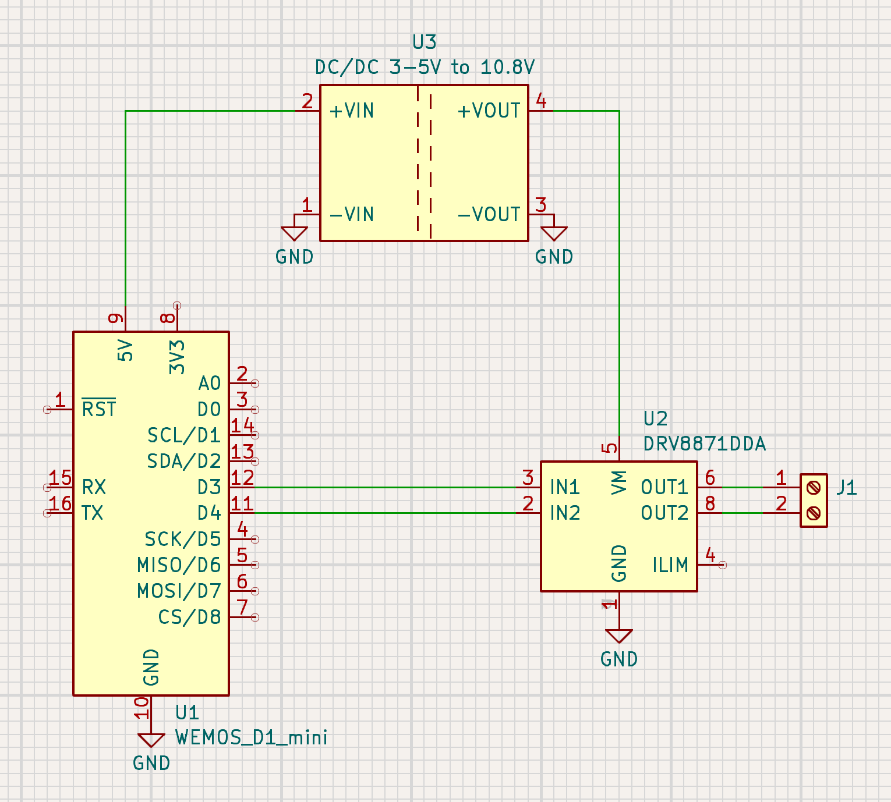

# NTP based controller for 12V/24V clocks by CTW (Nebenuhr)

This nice, former railway-station clock was a so-called "Nebenuhr", triggered by a central "Hauptuhr" with 24V pulses every minute. 

The wiring of the coils were initially in series for 24V usage, a quick change of the bridges made it parallel for 12V:

The motor is a [Lavet-type stepping motor](https://en.wikipedia.org/wiki/Lavet-type_stepping_motor), needing alternating pulses. These are created by a H-Bridge (like the [DRV-8833](https://duckduckgo.com/?q=DRV8833&t=osx&ia=web) or [DRV-8871](https://www.ti.com/product/DRV8871)).

## Implementation 

The [program](src/main.cpp) uses a straight-forward approach, with the usual suspects:

* [WiFiManager](https://github.com/tzapu/WiFiManager.git)
* [AceCommon](https://github.com/bxparks/AceCommon)/[AceTime](https://github.com/bxparks/AceTime) for NTP & TimeZone-management
* [ESP_DoubleResetDetector](https://github.com/khoih-prog/ESP_DoubleResetDetector)

After configuring the WiFi credentials by connecting to the AP `nebenuhr`, the time-zone and the currently displayed time on the clock must be adjusted.

If the displayed time is _before_ the current time, the step-motor is advanced by one step and the displayed time is incremented in the memory.

If the displayed time is less than 10 minutes in the future, the step-motor is not advanced, and the clock waits until displayed- and current-time matches.

## Hardware

* A RC123 powered ESP-8266 D1-Mini compatible board: [TTGO T-OI](https://de.aliexpress.com/item/4000429110448.html).
* A [MT3608 DC-DC Converter](https://de.aliexpress.com/item/1005005852649600.html)
* A [H-Bridge max. 10.8 V](https://de.aliexpress.com/item/1005009044264044.html) or with higher voltage limit [DRV-8871](https://de.aliexpress.com/item/1005009020365115.html)

## Usage

Upload the code to the ESP, connect the DC/DC-converter, adjust the output-voltage of the DC/DC-converter to the desired voltage (not exceeding the max. valtage of the H-Bridge) before connecting the H-Bridge. 

After connecting the H-Bridge and the clock, connect to the `nebenuhr` WiFi, enter credentials, wait for reboot, connect to [http://nebenuhr.local](http://nebenuhr.local), enter the currently displayed time and time-zone, and wait for the clock to advance to the current time.

If the clock stays 1 minute off, the polarity of the motor-connection must be reversed.
